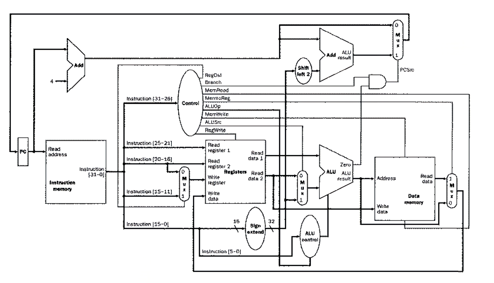
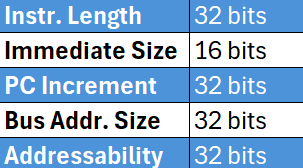
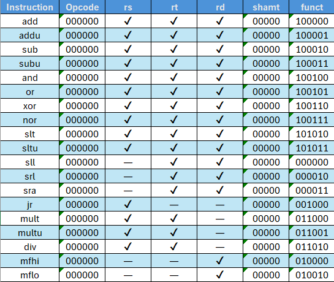
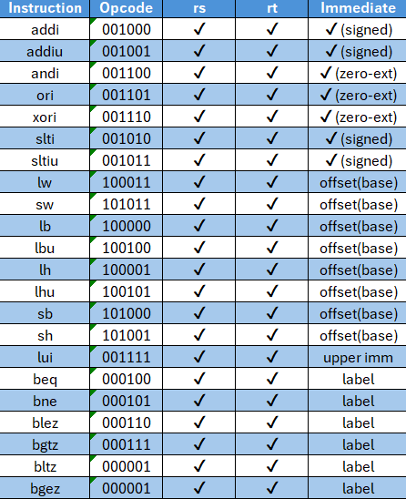
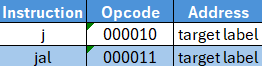
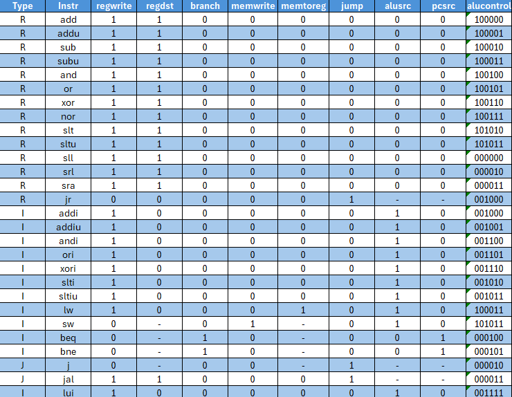
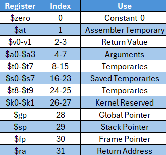

# ECE 251 Final Project - The Cooper Union Spring 2025:

# Zidane Karim and Tyler Lee

## Description
This project implements a 32-bit single-cycle MIPS CPU using Verilog. The design follows the structure of the MIPS instruction set architecture (ISA) and supports a wide range of R-type, I-type, and J-type instructions. The CPU is capable of executing arithmetic, logic, memory, and control flow instructions. An assembler, written in Python, translates MIPS assembly code into machine code compatible with the instruction memory.

## CPU Design

## Supported Instructions
The CPU supports a broad subset of the MIPS32 instruction set.

## Instruction Format
- Instruction width: 32 bits
- Immediate width: 16 bits (I-type)
- PC increment: 32 bits
- Memory addressable by words (32 bits)

### R-Type
- Arithmetic: `add`, `addu`, `sub`, `subu`, `mult`, `multu`, `div`
- Logic: `and`, `or`, `xor`, `nor`
- Comparison: `slt`, `sltu`
- Shift: `sll`, `srl`, `sra`
- Move: `mfhi`, `mflo`
- Control: `jr`

### I-Type
- Arithmetic/Logic: `addi`, `addiu`, `andi`, `ori`, `xori`, `slti`, `sltiu`
- Memory: `lw`, `sw`, `lb`, `lbu`, `lh`, `lhu`, `sb`, `sh`, `lui`
- Branch: `beq`, `bne`, `blez`, `bgtz`, `bltz`, `bgez`

### J-Type
- `j`, `jal`

## Control Signals
The control unit generates the following signals:
- `regwrite`, `regdst`, `branch`, `memwrite`, `memtoreg`, `jump`, `alusrc`, `pcsrc`, `alucontrol`

Control logic is handled by `maindec.sv` and `aludec.sv`, which translate opcodes and function fields into control signals.

## Register File
- 32 general-purpose registers: `$zero` to `$ra`
- Special-purpose: `$at`, `$k0`, `$k1`
- Caller-saved and callee-saved conventions are followed

## Assembler
The `assembler/parser.py` is a Python script that:
- Parses `.asm` files with labels and comments
- Translates instructions into machine code
- Outputs `.dat` file formatted for Verilog memory loading

## Memory Format
The memory system is split into two parts:
- Instruction Memory (IMEM):
    - Provides 32-bit instructions to control and datapath logic based on the PC value
    - Preloaded with machine code from a `.dat` file generated by the `parser.py`
    - Read only during the execution
 - Data Memory (DMEM): 
    - Used for dynamic data operations via lw, sw, lb, lbu, lh, lhu, sb, and sh
    - 32 bit wide, is byte-addressable
    - Read and write logic controlled by memwrite and memtoreg signals
 

